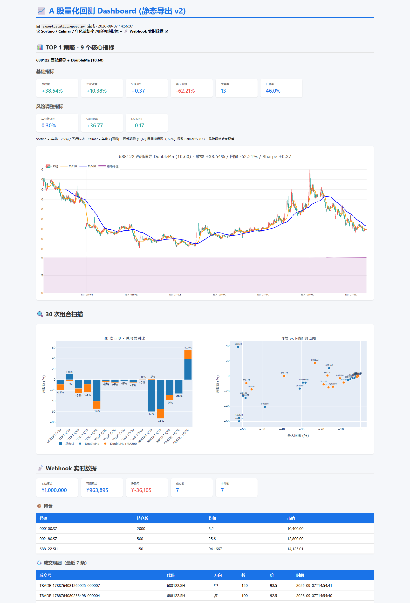

# 截图与功能展示

> 截图录制于 2026-09-07

## 1. Streamlit Dashboard 主页

四个 Tab：组合扫描、单股深度、历史结果、Webhook 实时。


## 2. 组合扫描（Tab 1）

3 只股同参数批量回测，Sharpe 排序，收益柱状图。


## 3. 单股深度（Tab 2）

K 线 + MA5/MA30 + 净值曲线 + 回撤辅助轴 + 9 个核心指标（6 基础 + 3 风险调整）。


## 4. 历史结果（Tab 3）

30 次扫描的"收益 vs 回撤"散点图，蓝色=纯双均线，橙色=+MA200 过滤。


## 5. Webhook 实时（Tab 4）

直接读 SQLite，显示真实成交/事件/持仓。


## 6. 静态导出报告

`export_static_report.py` 生成的单文件 HTML，离线可看。



## 7. 端到端测试

`tests/e2e_smoke.py` 8 项验收全部通过：

```
=== 1) health ===                ok
=== 2) buy 000001.SZ ... ===      ok
=== 3) 错误 secret 应被拒绝 ===    ok
=== 4) 同 event_id 重发应幂等 ===  ok
=== 5) P&L 计算正确 ===           ok
=== 6) 风控超量 ===              ok
=== 7) SQLite 能查 ===           ok
=== 8) trades 端点 ===           ok
ALL CHECKS PASSED
```

## 8. 回测结果示例

`backtest_3stocks.py` 输出（5/30 双均线，2023-2026）：

```
代码       名称          总收益      年化      夏普     最大回撤    胜日/总    交易
002180    纳思达       +10.34%    +2.78%    +0.32    -15.94%    43.32%      59
000100    TCL科技     -4.30%    -1.16%    -0.77    -5.15%    39.62%      81
688122    西部超导    -55.10%   -14.84%   -0.58    -61.74%    39.06%      47
```

## 9. 30 次扫描 TOP 5 by Sharpe

```
排名   股票       策略               参数        总收益       年化      Sharpe     回撤
1     西部超导    DoubleMa        10,60      +38.54%   +10.38%    +0.37   -62.21%
2     西部超导    DoubleMa+MA200  10,60      +17.38%   +4.68%     +0.36   -23.22%   ← 过滤后回撤砍半
3     纳思达      DoubleMa        5,30       +10.34%   +2.78%     +0.32   -15.94%
```
